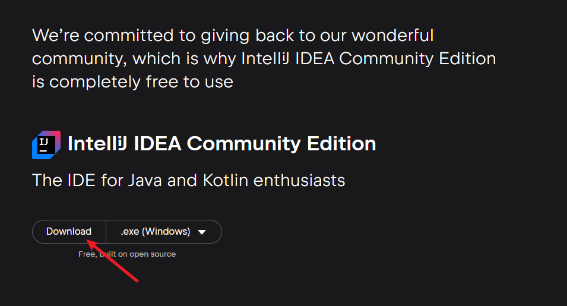
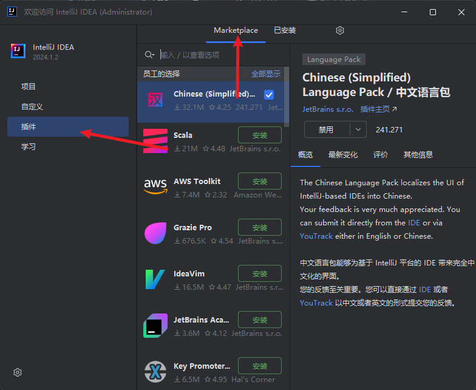
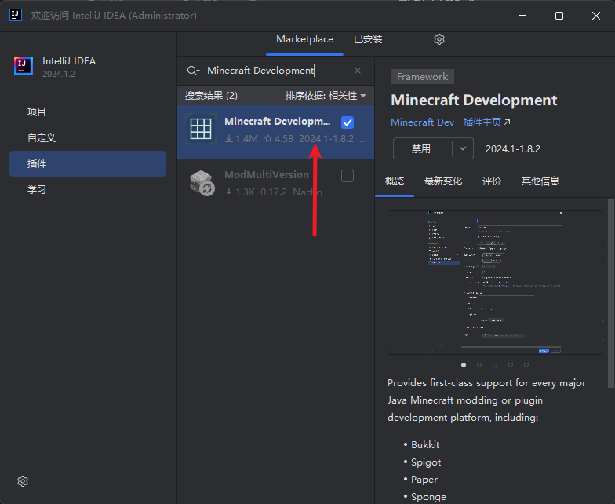
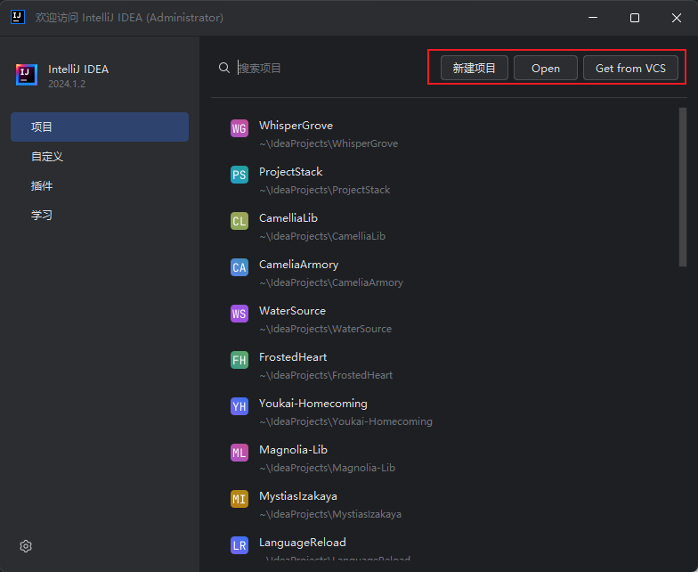
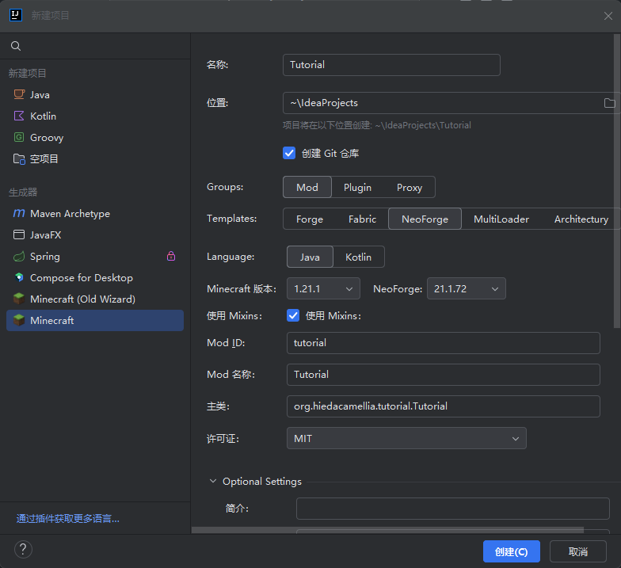
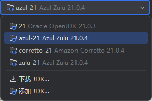
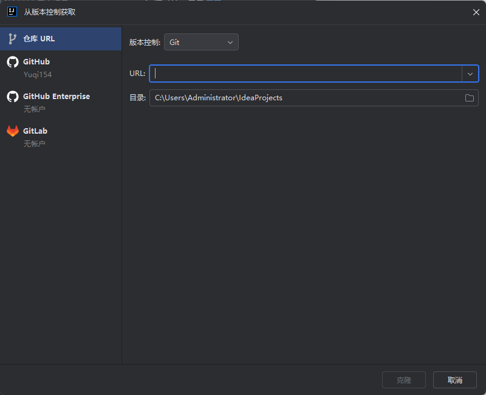

# 环境配置

## 安装IDE

虽然我的世界开发并不一定需要IDE，但是为了您的健康，还是建议您安装一个IDE。推荐使用IntelliJ IDEA。

### 安装 IntelliJ IDEA

1. 前往[官网](https://www.jetbrains.com/idea/download/?section=windows)

1. 往下拉，选择 Community 版本下载

   

1. 你会下载到一个`ideaIC-202x.x.x.exe` 的文件，运行它

1. 一路下一步完成安装

1. 安装完成后，打开 IntelliJ IDEA

### 安装IDEA插件

1. 打开插件管理，选择上方的`marketplace`

   

1. 安装中文语言包 ~~这应该不需要教~~

1. 搜索并安装`Minecraft Development`

   

1. 安装完成重启IDEA

### 创建项目

你有两种创建项目的方法：新建空白项目&从版本控制导入项目



#### 新建项目

1. 点击`新建项目`，打开这样的一个界面，选择`Minecraft`

   

1. 配置项目

    1. 填写项目名称  
      这里以`Tutorial`为例

    1. 勾选`创建git仓库`

    1. 依次选择 `Mod` `NeoForge` `Java`

    1. 选择Minecraft版本和NeoForge版本  
    这里我选择`1.21.1`和`21.1.72`  
       - `2025.7.14` 更新: 选择`21.1.192`

    1. modid和mod名称会根据你的项目名称自动生成，可以自行修改

    1. 许可证，参考[这里](https://www.runoob.com/w3cnote/open-source-license.html)

    1. 往下拉，点开`Optional Settings`  
    在这里选择Parchment，一般选择最新的。没有选项的话勾选`Older Minecraft versions`

    1. 构建系统设置  
    组id可以自己填写一个，一般是你的域名反写。比如`com.example`  
    工件id和版本一般不需要修改

    1. 选择你的JDK版本，在Minecraft1.20.5以上使用JDK21  
        

    1. 点击`创建`

#### 导入项目

1. 点击`从版本控制导入`或者`Get from VCS`，打开这样的一个界面

   

1. 填写`URL`，如`https://github.com/abcd/xxx.git`

1. 点击`克隆`，等待克隆完成

### 项目内配置

打开项目后，你的gradle会进行配置，这个过程可能会很慢，请耐心等待。  
~~真的很慢~~  
如果有条件可以使用代理服务。

1. `gradle.properties`

    因为mojang在1.21.1并没有更新内容，所以你的模组大概率可以同时运行在1.21和1.21.1上。  
    你可以在这里配置你的Minecraft版本
    
    ```properties
    minecraft_version_range=[1.21,1.22)
    ```

1. `build.gradle`

    你可以在这里配置你的模组构建系统，
    比如添加依赖，这里以`jei`为例。  
    neoforge给了相关的示例代码，但那是错误的。
    你需要将其修改成这样
    
    ```groovy
    
    compileOnly "mezz.jei:jei-${minecraft_version}-neoforge-api:${jei_version}"
    runtimeOnly "mezz.jei:jei-${minecraft_version}-neoforge:${jei_version}"

    ```

    在`gradle.properties`中新建一行

    ```properties
    jei_version=xx
    ```

    版本号可以在`curseforge`和`modrinth`上找到

    当然，你需要在`repositories`中添加相应的`maven`，否则你的gradle会找不到你要的东西

    ```groovy
    repositories {
        maven {
            // location of the maven that hosts JEI files since January 2023
            name = "Jared's maven"
            url = "https://maven.blamejared.com/"
        }
        maven {
            // location of a maven mirror for JEI files, as a fallback
            name = "ModMaven"
            url = "https://modmaven.dev"
        }
    }
    ```

    这时你进行构建，gradle会自动下载依赖

    其他用法：
    比如修改构建输出名称
    
    ```groovy
    base {
        archivesName = "${mod_id}-neoforge-${minecraft_version}"
    }
    ```

至此，你的项目已经配置完成，可以开始开发了。

> 上一章 [无]()  
> 下一章 [示例模组](2.md)