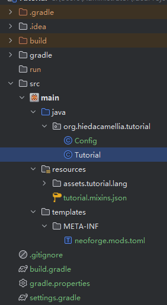
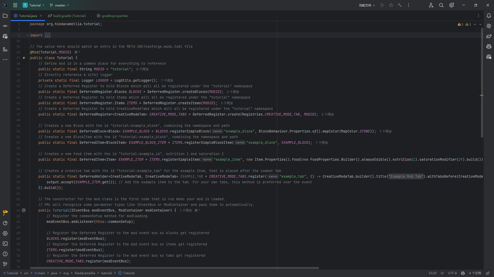

# 示例模组

本章节将对插件自动生成的example模组进行讲解

## 目录结构

你的代码将存放在`src/main/java`  
资源文件将存放在`src/main/resources`



## 主类

主类名称应该与你的项目名称是一样的，双击点开它



1. `@Mod`注解和MODID

    ```Java
    @Mod(Tutorial.MODID)
    public class Tutorial {
        public static final String MODID = "tutorial";
        ...
    }
    ```

    这个两个不用管，因为你应该不会在一个项目里开发多个模组

2. `Logger`  
    你需要将`LOGGER`改为`public static final`，这样你的其他类才能使用它
    ```Java
    public static final Logger LOGGER = LogUtils.getLogger();
    ```

3. 注册表

    ```Java
    public static final DeferredRegister.Blocks BLOCKS = DeferredRegister.createBlocks(MODID);
    public static final DeferredRegister.Items ITEMS = DeferredRegister.createItems(MODID);
    public static final DeferredRegister<CreativeModeTab> CREATIVE_MODE_TABS = DeferredRegister.create(Registries.CREATIVE_MODE_TAB, MODID);
    ```

    这里的`DeferredRegister`是注册表，使用它可以在neoforge中注册所有Minecraft内容，这里我们注册了方块、物品和创造模式标签页

4. 注册

    ```Java
    public static final DeferredBlock<Block> EXAMPLE_BLOCK = BLOCKS.registerSimpleBlock("example_block", BlockBehaviour.Properties.of().mapColor(MapColor.STONE));
    ```
    这段代码注册了一个方块，方块id是`example_block`，地图材质是`STONE`

    ```Java
    public static final DeferredItem<BlockItem> EXAMPLE_BLOCK_ITEM = ITEMS.registerSimpleBlockItem("example_block", EXAMPLE_BLOCK);
    ```
    这段代码将方块注册为物品，物品id是`example_block`，方块是`EXAMPLE_BLOCK`  
    这个物品可以用来放置EXAMPLE_BLOCK的方块

    ```Java
    public static final DeferredItem<Item> EXAMPLE_ITEM = ITEMS.registerSimpleItem("example_item", new Item.Properties().food(new FoodProperties.Builder().alwaysEdible().nutrition(1).saturationModifier(2f).build()));
    ```
    这段代码注册了一个物品，物品id是`example_item`  
    调用了food方法将其注册为食物  
    `nutrition`食物的饱食度为1  
    `saturationModifier`饱和度乘数为2  
    饱和度为1*2=2  
    `alwaysEdible`方法允许在饱食度满的时候继续食用

    ```Java
    public static final DeferredHolder<CreativeModeTab, CreativeModeTab> EXAMPLE_TAB = CREATIVE_MODE_TABS.register("example_tab", () -> CreativeModeTab.builder().title(Component.translatable("itemGroup.tutorial")).withTabsBefore(CreativeModeTabs.COMBAT).icon(() -> EXAMPLE_ITEM.get().getDefaultInstance()).displayItems((parameters, output) -> {
            output.accept(EXAMPLE_ITEM.get()); 
        }).build());
    ```
    这里注册了一个创造模式标签页，标签id是`example_tab`  
    显示名称为`Component.translatable("itemGroup.tutorial")`  
    图标是`EXAMPLE_ITEM`  
    标签页中展示的物品有`EXAMPLE_ITEM`  
    `Component.translatable`可以从lang文件中获取本地化文本，此处`itemGroup.tutorial`，对应的是`Example Mod Tab`

5. 总线

    ```Java
    public Tutorial(IEventBus modEventBus, ModContainer modContainer) {
        modEventBus.addListener(this::commonSetup);
        BLOCKS.register(modEventBus);
        ITEMS.register(modEventBus);
        CREATIVE_MODE_TABS.register(modEventBus);
        NeoForge.EVENT_BUS.register(this);
        modEventBus.addListener(this::addCreative);
        modContainer.registerConfig(ModConfig.Type.COMMON, Config.SPEC);
    }
    ```
    在主类的构造方法中，我们可以调用总线`IEventBus`  
    ```Java
    BLOCKS.register(modEventBus);
    ITEMS.register(modEventBus);
    CREATIVE_MODE_TABS.register(modEventBus);
    ```
    这三行对注册表进行注册，之后在游戏中将可以使用它们  
    ```Java
    modContainer.registerConfig(ModConfig.Type.COMMON, Config.SPEC);
    ```
    此处对Config进行注册，类型是`COMMON`，将在`config`文件夹生成一个`modid-common.toml`的文件用于存放配置信息
    ```Java
    modEventBus.addListener(this::commonSetup);
    modEventBus.addListener(this::addCreative);
    ```
    这两条是将`commonSetup`和`addCreative`两个事件监听方法注册进总线
    ```Java
    NeoForge.EVENT_BUS.register(this);
    ```
    这一行将这个类进行事件监听，这个类中所有拥有`@SubscribeEvent`注解的方法将自动注册进总线。  
    你还可以对这个类使用`@EventBusSubscriber`注解以实现相同功能

1. 事件
    ```Java
    private void commonSetup(final FMLCommonSetupEvent event) {
        // Some common setup code
        LOGGER.info("HELLO FROM COMMON SETUP");

        if (Config.logDirtBlock) LOGGER.info("DIRT BLOCK >> {}", BuiltInRegistries.BLOCK.getKey(Blocks.DIRT));

        LOGGER.info(Config.magicNumberIntroduction + Config.magicNumber);

        Config.items.forEach((item) -> LOGGER.info("ITEM >> {}", item.toString()));
    }
    ```
    此处监听了`FMLCommonSetupEvent`事件，输出了一些信息，在游戏启动时运行
    ```Java
    private void addCreative(BuildCreativeModeTabContentsEvent event) {
        if (event.getTabKey() == CreativeModeTabs.BUILDING_BLOCKS) event.accept(EXAMPLE_BLOCK_ITEM);
    }
    ```
    此处监听了`BuildCreativeModeTabContentsEvent`事件，将`EXAMPLE_BLOCK_ITEM`添加进了`CreativeModeTabs.BUILDING_BLOCKS`标签页
    ```Java
    public void onServerStarting(ServerStartingEvent event) {
        // Do something when the server starts
        LOGGER.info("HELLO from server starting");
    }
    ```
    这里监听`ServerStartingEvent`,在服务端启动时运行代码
    ```Java
    @EventBusSubscriber(modid = MODID, bus = EventBusSubscriber.Bus.MOD, value = Dist.CLIENT)
    public static class ClientModEvents {
        @SubscribeEvent
        public static void onClientSetup(FMLClientSetupEvent event) {
            // Some client setup code
            LOGGER.info("HELLO FROM CLIENT SETUP");
            LOGGER.info("MINECRAFT NAME >> {}", Minecraft.getInstance().getUser().getName());
        }
    }
    ```
    这里对`ClientModEvents`类进行监听，拥有`@SubscribeEvent`注解的`onClientSetup`方法被注册进总线  
    该方法监听`FMLClientSetupEvent`事件，在客户端启动时运行  
    在`@EventBusSubscriber`注解中有几个参数  
    `modid`不多说
    `bus`有两个值，分别是`GAME`和`MOD`，分别对应着游戏总线和模组总线
    `value`则规定了这个类将在客户端(`Dist.CLIENT`)被加载

1. Config

    我们打开同目录下的`Config`类  
    这里提供了大部分会用到的Config类型
    ```Java
    private static final ModConfigSpec.Builder BUILDER = new ModConfigSpec.Builder();
    ```
    创建一个Config的Builder，很好理解
    ```Java
    private static final ModConfigSpec.BooleanValue LOG_DIRT_BLOCK = BUILDER.comment("Whether to log the dirt block on common setup").define("logDirtBlock", true);

    private static final ModConfigSpec.IntValue MAGIC_NUMBER = BUILDER.comment("A magic number").defineInRange("magicNumber", 42, 0, Integer.MAX_VALUE);

    public static final ModConfigSpec.ConfigValue<String> MAGIC_NUMBER_INTRODUCTION = BUILDER.comment("What you want the introduction message to be for the magic number").define("magicNumberIntroduction", "The magic number is... ");
    
    private static final ModConfigSpec.ConfigValue<List<? extends String>> ITEM_STRINGS = BUILDER.comment("A list of items to log on common setup.").defineListAllowEmpty("items", List.of("minecraft:iron_ingot"), Config::validateItemName);
    ```
    这里注册了4种变量类型，分别是`Boolean` `Integer` `String` `List<String>`  
    除了已经内置的`BooleanValue` `IntValue` `DoubleValue` `LongValue` `EnumValue` `ListValueSpec`外，还可以使用`ConfigValue<T>`来使用其他类型的数据类型  
    通过使用`BUILDER`中的`define`等方法，可以简单的创建一个配置项

    ```Java
    static final ModConfigSpec SPEC = BUILDER.build();
    ```
    完成配置后生成Spec，将其注册进模组容器后，你就可以在模组中使用从配置文件读取的内容了

1. 补充

    我在这里补充一下Config中Onload方法中一个高级的用法
    ```Java
    public static Set<Item> items = ITEM_STRINGS.get().stream().map(itemName -> BuiltInRegistries.ITEM.get(ResourceLocation.parse(itemName))).collect(Collectors.toSet());
    ```
    这里获取到`ITEM_STRINGS`的值，是`List<String>`，我们将其转换为`stream`进行`map`处理，即对每个值都进行`itemName -> BuiltInRegistries.ITEM.get(ResourceLocation.parse(itemName)`，从注册表中获取字符串对应的物品，最后使用`collect`将结果转换为`Set<Item>`  
    这样写代码可以有效降低代码复杂性和 ~~可读性~~